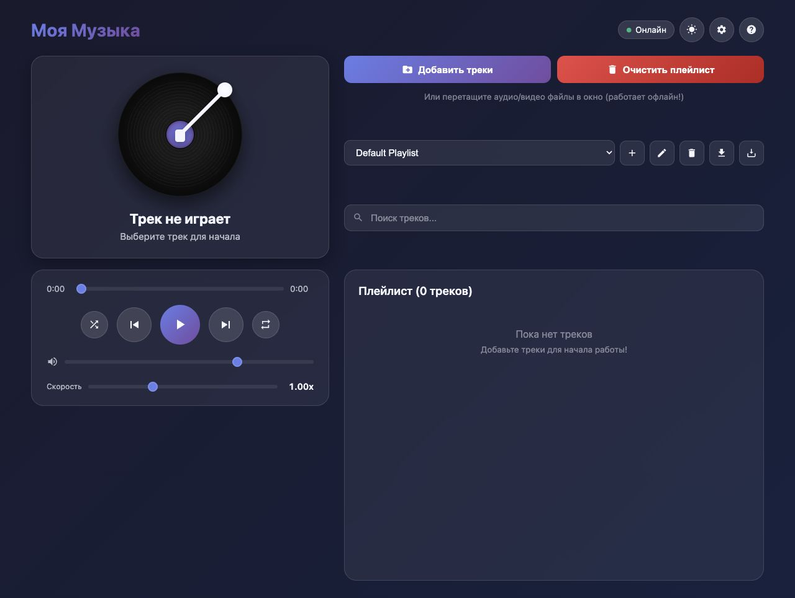

# Offline Music Player PWA

[](https://github.com/RAZEX0LOL/music-player-pwa/actions/workflows/ci.yml)
[](https://razex0lol.github.io/music-player-pwa/)
[](LICENSE)

A privacy-first progressive web app that turns local audio files into an installable offline music library. Tracks stay inside the browser: there is no account, backend, analytics, or upload step.

**[Open the live app](https://razex0lol.github.io/music-player-pwa/)** · [English user guide](USER-GUIDE.md) · [Руководство на русском](INSTRUKCIYA.md)



## Why this project

Streaming services are not always available, private, or reliable offline. This app provides a device-local player with the convenience of an installed application while keeping the library under the user's control.

## Features

- Offline app shell powered by a Service Worker.
- Local audio storage in IndexedDB with no server upload.
- Multiple playlists with import, export, search, and drag-and-drop.
- Playback queue with previous/next, shuffle, repeat-one, and repeat-all modes.
- Media Session integration for lock screens, headsets, car controls, and media keys.
- ID3 metadata, album artwork, embedded lyrics, and an audio visualizer.
- Sleep timer, playback speed, volume, light/dark themes, and accent colors.
- Storage quota visibility and persistent-storage requests where supported.
- Responsive desktop and mobile layouts with an installable PWA manifest.
- Russian and English interface text selected from the browser language.

## Architecture

```text
Browser UI
  ├─ MusicPlayer — playback state, playlists, search and Media Session
  ├─ MusicDB — IndexedDB persistence for tracks and binary audio data
  ├─ player-utils.js — tested playback and validation rules
  ├─ jsmediatags — local ID3 metadata extraction
  └─ Service Worker — cached app shell and offline navigation fallback
```

The application deliberately has no backend. Static files are served by GitHub Pages, while a user's music and preferences remain in that browser profile.

## Run locally

The app must be served over HTTP rather than opened through `file://` so the Service Worker and module imports can run.

```bash
python3 -m http.server 8000
```

Open `http://localhost:8000`. No dependency installation or build step is required.

## Quality checks

Node.js 22 or newer is used only for repository checks; it is not required by the browser application.

```bash
npm test
npm run check
```

The check command runs:

- syntax validation for the application, utilities, and Service Worker;
- PWA manifest and app-shell integrity checks;
- dependency-free unit tests for playback navigation, repeat modes, media-file validation, and formatting.

GitHub Actions executes the same command for every pull request and every push to `master`.

## Offline behavior

On the first online visit, the Service Worker caches the application shell. Navigations use a network-first strategy with an offline fallback, while same-origin static assets use cache-first delivery. Imported music is stored separately in IndexedDB and is never added to the HTTP cache.

Browser storage can still be cleared by the user, the operating system, or storage pressure. Use the playlist backup function before clearing site data or changing devices.

## Privacy and security

- No account, cookies, analytics, advertising, or remote media upload.
- Audio blobs, metadata, playlists, and settings remain on the device.
- Imported files are validated by size and media type/extension before storage.
- Third-party metadata parsing is vendored so it remains available offline.

Security reports are handled according to [SECURITY.md](SECURITY.md).

## Project structure

```text
.
├── .github/workflows/ci.yml
├── docs/images/player-dashboard.jpg
├── icons/
├── scripts/validate-pwa.mjs
├── test/player-utils.test.js
├── vendor/jsmediatags.min.js
├── app.js
├── index.html
├── manifest.json
├── player-utils.js
├── styles.css
└── sw.js
```

## Limitations

- Codec support depends on the browser and operating system.
- Storage quotas vary by browser, device, and available disk space.
- iOS and desktop browsers expose different PWA and Media Session capabilities.
- Backups containing audio data can become large.

## License

[MIT](LICENSE) © 2026 Rasul Khattaev.
